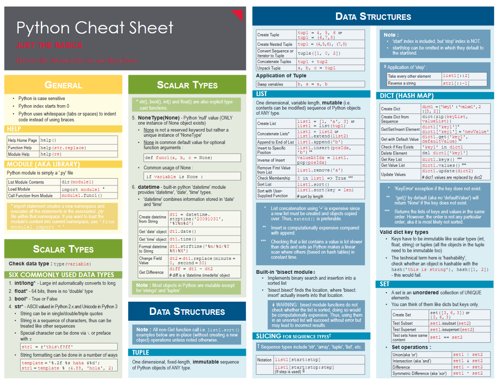

# Useful Python Cheatsheet Links

## Basic Python 

1) gto76 — [extensive Python cheat sheet](https://github.com/gto76/python-cheatsheet) offered by GitHub 
2) [https://www.pythoncheatsheet.org/](https://www.pythoncheatsheet.org/)
3) [Cheatography](https://cheatography.com/davechild/cheat-sheets/python/)
4) [Python crash course](https://ehmatthes.github.io/pcc/cheatsheets/README.html)
5) DataQuest ( [basic](https://s3.amazonaws.com/dq-blog-files/python-cheat-sheet-basic.pdf) and [intermediate](https://s3.amazonaws.com/dq-blog-files/python-cheat-sheet-intermediate.pdf) )
6) [MementoPython3](https://perso.limsi.fr/pointal/_media/python:cours:mementopython3-english.pdf)

## Numpy
1) [DataCamp](http://datacamp-community-prod.s3.amazonaws.com/ba1fe95a-8b70-4d2f-95b0-bc954e9071b0)
2) [Intellipat](https://intellipaat.com/mediaFiles/2018/12/Python-NumPy-Cheat-Sheet-1.png)
3) [A Little Bit of Everything](http://datasciencefree.com/numpy.pdf)
4) [DataQuest](https://s3.amazonaws.com/dq-blog-files/numpy-cheat-sheet.pdf)
5) [Numpy for R (and s_plus) Users](http://mathesaurus.sourceforge.net/r-numpy.html)
6) [Ipgp github](https://ipgp.github.io/scientific_python_cheat_sheet/?utm_content=buffer7d821&utm_medium=social&utm_source=twitter.com&utm_campaign=buffer#numpy-import-numpy-as-np)

## Pandas
1) [The Most Comprehensive Cheat Sheet](https://pandas.pydata.org/Pandas_Cheat_Sheet.pdf)
2) [The Beginner’s Cheat Sheet](https://www.dataquest.io/blog/pandas-cheat-sheet/)
3) [DATACAMP](http://datacamp-community-prod.s3.amazonaws.com/f04456d7-8e61-482f-9cc9-da6f7f25fc9b)
4) [Data Science Central (compact)](http://datacamp-community-prod.s3.amazonaws.com/dbed353d-2757-4617-8206-8767ab379ab3)
5) [INTELLIPAT](https://intellipaat.com/mediaFiles/2018/12/Python-Pandas-Cheat-Sheet.png)

## Matplotlib
1) [Datacamp](http://datacamp-community-prod.s3.amazonaws.com/e1a8f39d-71ad-4d13-9a6b-618fe1b8c9e9)
2) [GitHub](https://camo.githubusercontent.com/bc3b143766ed68eb6a851900c317c5d9222eb1471888942afb35137aa5141557/68747470733a2f2f6d6174706c6f746c69622e6f72672f63686561747368656574732f63686561747368656574732d312e706e67)
3) [Cheatography](https://cheatography.com/aggialavura/cheat-sheets/python-matplotlib/pdf_bw/)
4) [Becominghuman.ai](https://miro.medium.com/max/1890/1*uZOP1Jv2P3uyngWnTfO9Kg.png)
5) [Travis_Blog](https://www.travistang.com/blog/-matplotlib-cheat-sheet-for-quick-data-visualization)

## Seaborn
1) [Datacamp](https://s3.amazonaws.com/assets.datacamp.com/blog_assets/Python_Seaborn_Cheat_Sheet.pdf)
2) [Cheatography](https://cheatography.com/justin1209/cheat-sheets/seaborn/)
3) [MartinNormark](https://martinnormark.com/a-simple-cheat-sheet-for-seaborn-data-visualization-2/)
4) [kaggle](https://www.kaggle.com/themlphdstudent/cheat-sheet-seaborn-charts)